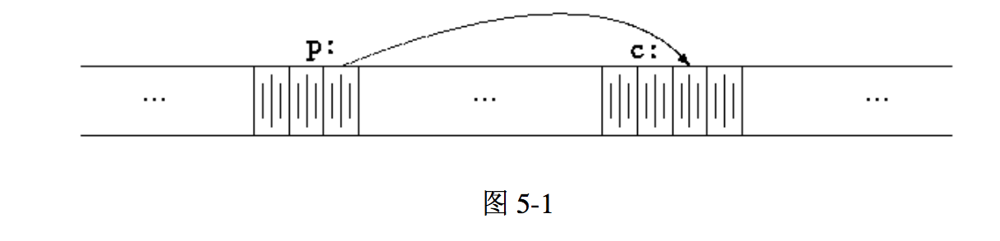

# The C Programming Language (Second Edition)

> Brian W. Kernighan, Dennis M. Ritchie

<!-- TOC -->

- [Preface](#preface)
- [Preface to the First Edition](#preface-to-the-first-edition)
- [Introduction](#introduction)
- [Chapter 1. A Tutorial Introduction](#chapter-1-a-tutorial-introduction)
- [Chapter 2. Types, Operators, and Expressions](#chapter-2-types-operators-and-expressions)
- [Chapter 3. Control Flow](#chapter-3-control-flow)
- [Chapter 4. Functions and Program Structure](#chapter-4-functions-and-program-structure)
- [Chapter 5. Pointers and Array 指针与数组](#chapter-5-pointers-and-array-指针与数组)
    - [5.1 Pointers and Addresses 指针与地址](#51-pointers-and-addresses-指针与地址)
    - [5.2 Pointers and Function Arguments 指针与函数参数](#52-pointers-and-function-arguments-指针与函数参数)
- [Chapter 6. Structures](#chapter-6-structures)
- [Chapter 7. Input and Output](#chapter-7-input-and-output)
- [Chapter 8. The UNIX System Interface](#chapter-8-the-unix-system-interface)
- [Appendix A. Reference Manual](#appendix-a-reference-manual)
- [Appendix B. Standard Library](#appendix-b-standard-library)
- [Appendix C. Summary of Changes](#appendix-c-summary-of-changes)

<!-- /TOC -->

## Preface

The computing world has undergone a revolution since the publication of The C Programming Language in 1978. Big computers are much bigger, and personal computers have capabilities that rival the mainframes of a decade ago. During this time, C has changed too, although only modestly, and it has spread
far beyond its origins as the language of the UNIX operating system.

The growing popularity of C, the changes in the language over the years, and the creation of compilers by groups not involved in its design, combined to
demonstrate a need for a more precise and more contemporary definition of the language than the first edition of this book provided. In 1983, the American ' National Standards Institute (ANSI) established a committee whose goal was to produce "an unambiguous and machine-independent definition of the language C," while still retaining its spirit. The result is the ANSI standard for C.

The standard formalizes constructions that were hinted at but not described in the first edition, particularly structure assignment and enumerations. It provides a new form of function declaration that permits cross-checking of definition with use. It specifiesa standard library, with an extensiveset of functions for performing input and output, memory management, string manipulation, and similar tasks. It makes precise the behavior of features that were not spelled out in the original definition, and at the same time states explicitly which aspects of the language remain machine-dependent.

This second edition of The C Programming Language describes C as defined by the ANSI standard. Although we have noted the places where the language has evolved,we have chosen to write exclusivelyin the new form. For the most part, this makes no significant difference; the most visible change is the new form of function declaration and definition. Modern compilers already support most features of the standard.

We have tried to retain the brevity of the first edition. C is not a big language, and it is not well served by a big book. We have improved the exposition of critical features, such as pointers, that are central to C programming. We have refined the original examples, and have added new examples in several chapters. For instance, the treatment of complicated declarations is augmented by programs that convert declarations into words and vice versa. As before, all examples have been tested directly from the text, which is in machine-readable form.

Appendix A, the reference manual, is not the standard, but our attempt to convey the essentials of the standard in a smaller space. It is meant for easy comprehension by programmers, but not as a definition for compiler writersthat role properly belongs to the standard itself. Appendix B is a summary of the facilities of the standard library. It too is meant for reference by programmers, not implementers. Appendix C is a concise summary of the changes from the original version.

As we said in the preface to the first edition, C "wears well as one's experience with it grows." With a decade more experience, we still feel that way. We hope that this book will help you to learn C and to use it well.

We are deeply indebted to friends who helped us to produce this second edition. Jon Bentley, Doug Gwyn, Doug Mcllroy, Peter Nelson, and Rob Pike gave us perceptive comments on almost every page of draft manuscripts. We are grateful for careful reading by Al Aho, Dennis Allison, Joe Campbell, G. R. Emlin, Karen Fortgang, Allen Holub, Andrew Hume, Dave Kristol, John Linderman, Dave Prosser, Gene Spafford, and Chris Van Wyk. We also received helpful suggestions from BHl Cheswick, Mark Kernighan, Andy Koenig, Robin Lake, Tom London, Jim Reeds, Clovis Tondo, and Peter Weinberger. Dave Prosser answered many detailed questions about the ANSI standard. We used Bjarne Stroustrup's C++ translator extensively for local testing of our programs, and Pave Kristol provided us with an ANSI C compiler for final testing, Rich Drechsler helped greatly with typesetting.

Our sincere thanks to all.

## Preface to the First Edition
...

## Introduction
C is a general-purpose programming language. It has been closely associated with the UNIX system where it was developed, since both the system and most of the programs that run on it are written in C. The language, however,is not tied to anyone operating system or machine; and although it has been called a "system programming language" because it is useful for writing compilers and operating systems, it has been used equally well to write major programs in many different domains.

Many of the important ideas of C stem from the language BCPL, developed by Martin Richards. The influence of BCPL on C proceeded indirectly through the language B, which was written by Ken Thompson in 1970 for the first UNIX system on the DEC PDP-7.

BCPL and Bare "typeless" languages. By contrast, C provides a variety of data types. The fundamental types are characters, and integers and floatingpoint numbers of several sizes. In addition, there is a hierarchy of derived data types created with pointers, arrays, structures, and unions. Expressions are formed from operators and operands; any expression, including an assignment or a function call, can be a statement. Pointers provide for machine-independent address arithmetic.

C provides the fundamental control-flow constructions required for well-structured programs: statement grouping, decision making (if-else), selecting one of a set of possible cases (switch), looping with the termination test at the top (while, for) or at the bottom (do), and early loop exit (break).

Functions may return values of basic types, structures, unions, or pointers. Any function may be called recursively. Local variables are typically "automatic," or created anew with each invocation. Function definitions may not be nested but variables may be declared in a block-structured fashion. The functions of a C program may exist in separate source files that are compiled separately. Variables may be internal to a function, external but known only within a single source file, or visible to the entire program.

A preprocessing step performs macro substitution on program text, inclusion of other source files, and conditional compilation.

C is a relatively "low level" language. This characterization is not pejorative; it simply means that C deals with the same sort of objects that most computers do, namely characters, numbers, and addresses. These may be combined and moved about with the arithmetic and logical operators implemented by real machines.

C provides no operations to deal directly with composite objects such as character strings, sets, lists, or arrays. There are no operations that manipulate an entire array or string, although structures may be copied as a unit. The language does not define any storage allocation facility other than static definition and the stack discipline provided by the local variables of functions; there is no heap or garbage collection. Finally, C itself provides no input/output facilities; there are no READ or WRITE statements, and no built-in file access methods. All of these higher-level mechanisms must be provided by explicitlycalled functions. Most C implementations have included a reasonably standard collection of such functions.

Similarly, C offers only straightforward, single-thread control flow: tests, loops, grouping, and subprograms, but not multiprogramming, parallel operations, synchronization, or coroutines.

Although the absence of some of these features may seem like a grave deficiency ("You mean I have to call a function to compare two character strings?"), keeping the language down to modest size has real benefits. Since C is relatively small, it can be described in a small space, and learned quickly. A programmer can reasonably expect to know and understand and indeed regularly use the entire language.

For many years, the definition of C was the reference manual in the first edition of The C Programming Language. In 1983, the American National Standards Institute (ANSI) established a committee to provide a modern, comprehensive definition of C. The resulting definition, the ANSI standard, or "ANSI C," was completed late in 1988. Most of the features of the standard are already supported by modern compilers.

The standard is based on the original reference manual. The language is relatively little changed; one of the goals of the standard was to make sure that most existing programs would remain valid, or, failing that, that compilers could produce warnings of new behavior.

For most programmers, the most important change is a new syntax for declaring and defining functions. A function declaration can now include a description of the arguments of the function; the definition syntax changes to match. This extra information makes it much easier for compilers to detect errors caused by mismatched arguments; in our experience, it is a very useful addition to the language.

There are other small-scale language changes. Structure assignment and enumerations, which had been widely available, are now officially part of the language. Floating-point computations may now be done in single precision. The properties of arithmetic, especially for unsigned types, are clarified. The preprocessor is more elaborate. Most of these changes will have only minor effects on most programmers.

A second significant contribution of the standard is the definition of a library
to accompany C. It specifies functions for accessing the operating system (for instance, to read and write files), formatted input and output, memory allocation, string manipulation, and the like. A collection of standard headers provides uniform access to declarations of functions and data types. Programs that use this library to interact with a host system are assured of compatible behavior. Most of the library is closely modeled on the "standard 1/0 library" of the UNIX system. This library was described in the first edition, and has been widely used on other systems as well. Again, most programmers will not see much change.

Because the data types and control structures provided by C are supported directly by most computers, the run-time library required to implement selfcontained programs is tiny. The standard library functions are only called explicitly, so they can be avoided if they are not needed. Most can be written in C, and except for the operating system details they conceal, are themselves portable.

Although C matches the capabilities of many computers, it is independent of any particular machine architecture. With a little care' it is easy to write portable programs, that is, programs that can be run without change on a variety of hardware. The standard makes portability issues explicit, and prescribes a set of constants that characterize the machine on which the program is run.

C is not a strongly-typed language, but as it has evolved, its type-checking has been strengthened. The original definition of C frowned on, but permitted, the interchange of pointers and integers; this has long since been eliminated, and the standard now requires the proper declarations and explicit conversionsthat had already been enforced by good compilers. The new function declarations are another step in this direction. Compilers will warn of most type errors, and there is no automatic conversion of incompatible data types. Nevertheless, C retains the basic philosophy that programmers know what they are doing; it only requires that they state their intentions explicitly.

C, like any other language, has its blemishes. Some of the operators have the wrong precedence; some parts of the syntax could be better. Nonetheless, C has proven to be an extremely effective and expressive language for a wide variety of programming applications.

The book is organized as follows. Chapter 1 is a tutorial on the central part of C. The purpose is to get the reader started as quickly as possible, since we believe strongly that the way to learn a new language is to write programs in it. The tutorial does assume a working knowledge of the basic elements of programming; there is no explanation of computers, of compilation, nor of the meaning of an expressionlike n=n+ 1. Although we have tried where possibleto show useful programming techniques, the book is not intended to be a reference work on data structures and algorithms; when forced to make a choice, we have Concentratedon the language.

Chapters 2 through 6 discuss various aspects of C in more detail, and rather more formally, than does Chapter 1, although the emphasis is still on examples of complete programs, rather than isolated fragments. Chapter 2 deals with the basic data types, operators and expressions. Chapter 3 treats control flow: if-else, switcb,while,for, etc. Chapter4coversfunctionsandprogram structure-external variables, scope rules, multiple source files, and so on-and also touches on the preprocessor. Chapter 5 discusses pointers and address arithmetic. Chapter 6 covers structures and unions.

Chapter 7 describes the standard library, which provides a common interface to the operating system. This library is defined by the ANSI standard and is meant to be supported on all machines that support C, so programs that use it for input, output, and other operating system access can be moved from one system to another without change.

Chapter 8 describes an interface between C programs and the UNIX operating system, concentrating on input/output, the file system, and storage allocation. Although some of this chapter is specific to UNIX systems, programmers who use other systems should still find useful material here, including some insight into how one version of the standard library is implemented, and suggestions on portability.

Appendix A contains a language reference manual. The official statement of the syntax and semantics of C is the ANSI standard itself. That document, however, is intended foremost for compiler writers. The reference manual here conveys the definition of the language more concisely and without the same legalistic style. Appendix B is a summary of the standard library, again for users rather than implementers. Appendix C is a short summary of changes from the original language. In cases of doubt, however, the standard and one's own compiler remain the final authorities on the language.

## Chapter 1. A Tutorial Introduction

## Chapter 2. Types, Operators, and Expressions

## Chapter 3. Control Flow

## Chapter 4. Functions and Program Structure

## Chapter 5. Pointers and Array 指针与数组

A pointer is a variable that contains the address of a variable. Pointers are much used in C, partly because they are sometimes the only way to express a computation, and partly because they usually lead to more compact and efficient code than can be obtained in other ways. Pointers and arrays are closely related; this chapter also explores this relationship and shows how to exploit it.

指针是一种保存变量地址的变量。在 C 语言中，指针的使用非常广泛，原因之一是，指针常常是表达某个计算的惟一途径，另一个原因是，同其它方法比较起来，使用指针通常可以生成更高效、更紧凑的代码。指针与数组之间的关系十分密切，我们将在本章中讨论它们之间的关系，并探讨如何利用这种关系。

Pointers have been lumped with the goto statement as a marvelous way to create impossibleto-understand programs. This is certainly true when they are used carelessly, and it is easy to create pointers that point somewhere unexpected. With discipline, however, pointers can also be used to achieve clarity and simplicity. This is the aspect that we will try to illustrate.

指针和 goto 语句一样，会导致程序难以理解。如果使用者粗心，指针很容易就指向了错误的地方。但是，如果谨慎地使用指针，便可以利用它写出简单、清晰的程序。在本章中我们将尽力说明这一点。

The main change in ANSI C is to make explicit the rules about how pointers can be manipulated, in effect mandating what good programmers already practice and good compilers already enforce. In addition, the type void * (pointer to void) replaces char * as the proper type for a generic pointer.

ANSI C 的一个最重要的变化是，它明确地制定了操纵指针的规则。事实上，这些规则已经被很多优秀的程序设计人员和编译器所采纳。此外，ANSI C 使用类型 `void *`（指向 void 的指针）代替 `char *` 作为通用指针的类型。

### 5.1 Pointers and Addresses 指针与地址

Let us begin with a simplified picture of how memory is organized. A typical machine has an array of consecutively numbered or addressed memory cells that may be manipulated individually or in contiguous groups. One common situation is that any byte can be a char, a pair of one-byte cells can be treated as a short integer, and four adjacent bytes form a long. A pointer is a group of cells (often two or four) that can hold an address. So if c is a char and p is a pointer that points to it, we could represent the situation this way:

首先，我们通过一个简单的示意图来说明内存是如何组织的。通常的机器都有一系列连续编号或编址的存储单元，过些存储单元可以单个进行操纵，也可以以连续成组的方式操纵。 通常情况下，机器的一个字节可以存放一个 char 类型的数据，两个相邻的字节存储单元可存储 1 个 short（短整型）类型的数据，而 4 个相邻的字节存储单元可存储 1 个 long（长整型）类型的数据。指针是能够存放一个地址的一组存储单元(通常是 2 个或 4 个字节)。因此，如果 c 的类型是 char，并且 p 是指向 c 的指针，则可用图 5-1 表示它们之间的关系:



----
The unary operator & gives the address of an object, so the statement 

一元运算符 & 可用于取一个对象的地址，因此，下列语句 

``` C
p = &c;
``` 

assigns the address of c to the variable p, and p is said to 'point to' c. The & operator only applies to objects in memory: variables and array elements. It cannot be applied to expressions, constants, or register variables.

将把 c 的地址赋值给变量 p，我们称 p 为指向 c 的指针。地址运算符 & 只能应用于内存中的对象，即变量与数组元素。它不能作用于表达式、常量或 register 类型的变量。

----
The unary operator * is the indirection or dereferencing operator; when applied to a pointer, it accesses the object the pointer points to. Suppose that x and y are integers and ip is a pointer to int. This artificial sequence shows how to declare a pointer and how to use & and *:

一元运算符 * 是间接寻址或间接引用运算符。当它作用于指针时，将访问指针所指向的对象。我们在这里假定 x 与 y 是整数，而 ip 是指向 int 类型的指针，下面的代码段说明了如何在程序中声明指针以及如何使用运算符 & 和 *:

``` C
int x = 1, y = 2, z[10];
int *ip;    /* ip is a pointer to int */
ip = &x;    /* ip now points to x */
y = *ip;    /* y is now 1 */
*ip = 0;    /* x is now 0 */
ip = &z[0]; /* ip now points to z[0] */
```

The declaration of x, y, and z are what we've seen all along. The declaration of the pointer ip, 

变量 x、y 与 z 的声明方式我们已经在前面的章节中见到过。我们来看指针 ip 的声明，如下所示:
``` C
int *ip;
``` 
is intended as a mnemonic; it says that the expression *ip is an int. The syntax of the declaration for a variable mimics the syntax of expressions in which the variable might appear. This reasoning applies to function declarations as well. For example,

这样声明是为了便于记忆。该声明语句表明表达式 *ip 的结果是 int 类型。这种声明变量的语法与声明该变量所在表达式的语法类似。同样的原因，对函数的声明也可以采用这种方式。例如，声明
``` C
double *dp, atof(char *);
```
says that in an expression *dp and atof(s) have values of double, and that the argument of atof is a pointer to char.

表明，在表达式中，*dp 和 atof(s) 的值都是 double 类型，且 atof 的参数是一个指向 char 类型的指针。

You should also note the implication that a pointer is constrained to point to a particular kind of object: every pointer points to a specific data type. (There is one exception: a 'pointer to void' is used to hold any type of pointer but cannot be dereferenced itself. We'll come back to it in Section 5.11.)

我们应该注意，指针只能指向某种特定类型的对象，也就是说，每个指针都必须指向某种特定的数据类型。(一个例外情况是指向 void 类型的指针可以存放指向任何类型的指针，但它不能间接引用其自身。我们将在 5.11 节中详细讨论该问题)。

If ip points to the integer x, then *ip can occur in any context where x could, so
``` C
// 如果指针 ip 指向整型变量，那么在 x 可以出现的任何上下文中都可以使用 *ip，因此，语句将把 *ip 的值增加 10
ip = *ip + 10;
```
increments *ip by 10.

The unary operators * and & bind more tightly than arithmetic operators, so the assignment
``` C
// 一元运算符 * 和 & 的优先级比算术运算符的优先级高，因此，赋值语句将把 *ip 指向的对象的值取出并加 1，然后再将结果赋值给 y
y = *ip + 1;
```
takes whatever ip points at, adds 1, and assigns the result to y, while
``` C
// 将 ip 指向的对象的值加 1
*ip += 1;
```
increments what ip points to, as do
``` C
++*ip;
```
and
``` C
(*ip)++;
```

The parentheses are necessary in this last example; without them, the expression would increment ip instead of what it points to, because unary operators like * and ++ associate right to left.

语句 (* ip)++ 中的圆括号是必需的，否则，该表达式将对 ip 进行加 1 运算， 而不是对 ip 指向的对象进行加 1 运算，这是因为，类似于 * 和 ++ 这样的一元运算符遵循从右至左的结合顺序。

----
Finally, since pointers are variables, they can be used without dereferencing. For example, if iq is another pointer to int,

最后说明一点，由于指针也是变量，所以在程序中可以直接使用，而不必通过间接引用的方法使用。例如，如果 iq 是另一个指向整型的指针，那么语句

``` C
iq = ip;
```

copies the contents of ip into iq, thus making iq point to whatever ip pointed to.

将把 ip 中的值拷贝到 iq 中，这样，指针 iq 也将指向 ip 指向的对象。

### 5.2 Pointers and Function Arguments 指针与函数参数

## Chapter 6. Structures

## Chapter 7. Input and Output

## Chapter 8. The UNIX System Interface

## Appendix A. Reference Manual

## Appendix B. Standard Library

## Appendix C. Summary of Changes